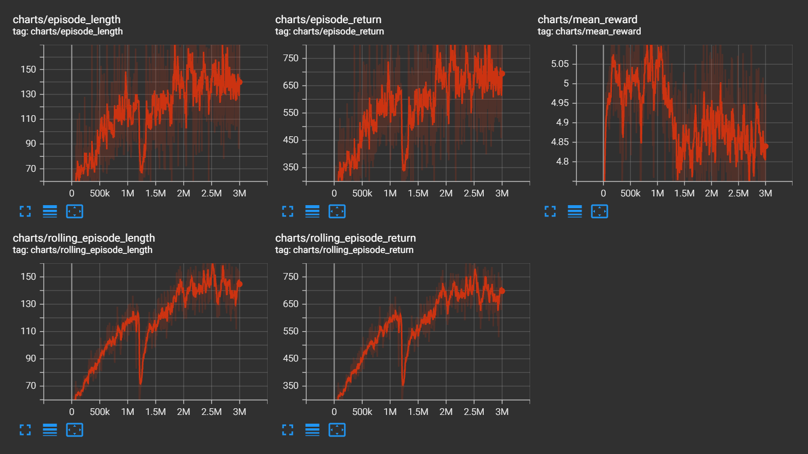
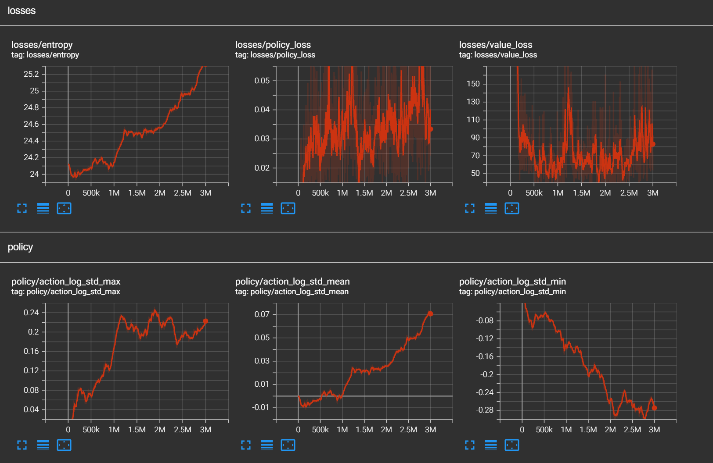
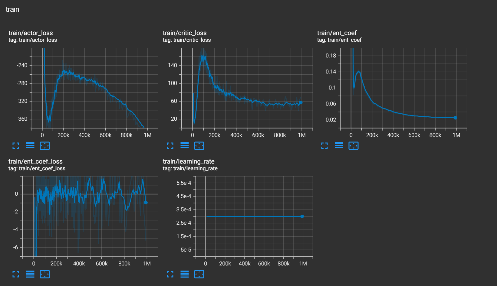
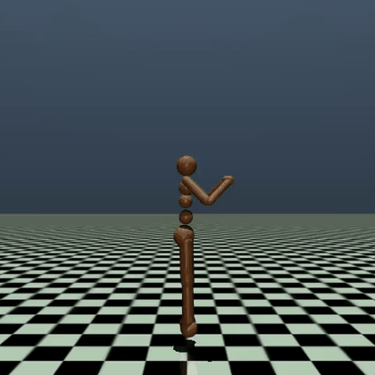

# Humanoid Locomotion RL

MaMuJoCo Humanoid 单智能体连续控制实验项目。仓库包含手写 PPO baseline、Stable-Baselines3 SAC 对照、复现实验命令、环境记录和结果摘要，适合作为项目展示与复现实验入口。

训练产生的 checkpoint、replay buffer、TensorBoard event、raw log 和完整视频体积较大，不纳入版本管理。

## 项目亮点

- 基于 Farama Gymnasium-Robotics 的 MaMuJoCo Humanoid，使用 `partitioning=None` 将完整 Humanoid 作为单智能体任务。
- 手写 PPO 实现覆盖 GAE、clipped objective、value loss、entropy logging、checkpoint 与 deterministic evaluation。
- PPO 训练诊断包含 observation normalization、approx KL、clip fraction、action clipping fraction 和 action log std。
- 支持 tanh-squashed Gaussian policy，并对 log probability 加入 Jacobian correction，避免环境端大比例裁剪动作。
- 提供 SB3 SAC 强基线，包含 `VecNormalize`、`Monitor`、自动熵调节、evaluation、TensorBoard 和视频渲染流程。

## 导航

| 路径 | 说明 |
| --- | --- |
| [`src/`](src/) | 训练、评估、渲染和环境封装代码 |
| [`results/ppo_sac_summary.md`](results/ppo_sac_summary.md) | PPO/SAC 核心结果摘要 |
| [`docs/environment.md`](docs/environment.md) | 主要实验环境记录 |
| [`assets/`](assets/) | README 和展示页面引用的小体积图表、截图与短视频 |
| [`requirements.txt`](requirements.txt) | Python 依赖列表 |

## 结果概览

### PPO Final Baseline

最终 PPO 配置：

- 实现方式：手写 PPO
- 环境：MaMuJoCo Humanoid，`partitioning=None`
- 训练步数：每个 seed `3M` timesteps
- observation normalization：开启
- policy：tanh-squashed Gaussian
- PPO update epochs：`4`
- evaluation：deterministic policy，每个 seed 10 个 episode

| Seed | Evaluation Mean Return | Evaluation Std | Tail Action Clip Fraction |
| ---: | ---: | ---: | ---: |
| 0 | 716.011 | 115.490 | 0.0000 |
| 1 | 899.806 | 190.234 | 0.0000 |
| 2 | 861.418 | 122.380 | 0.0000 |

三 seed evaluation mean return：

```text
825.745
```

### SAC Strong Baseline

SAC 配置：

- 实现方式：Stable-Baselines3 SAC
- 环境：同一个 MaMuJoCo Humanoid 单智能体任务
- 训练步数：`1M` timesteps
- seed：`0`
- observation normalization：SB3 `VecNormalize(norm_obs=True, norm_reward=False)`
- entropy coefficient：自动调节
- evaluation：deterministic policy，10 个 episode

```text
mean_return=6042.360
std_return=37.329
mean_length=1000.000
```

SAC seed `0` 的 10 个 evaluation episode 全部达到 `1000` step 时间上限，形成了本项目的强 off-policy 对照。该结果来自单 seed，稳定性结论仍以 PPO 三 seed baseline 为主。

视频观察显示，SAC seed `0` 能够稳定移动并获得较高 reward，但姿态明显前倾、屈身，不接近自然人类步态。因此这里将其描述为 reward-driven locomotion，而不是自然步态生成。

## 展示

### TensorBoard

<table>
  <tr>
    <td width="50%">
      <strong>PPO rollout metrics</strong><br>
      
    </td>
    <td width="50%">
      <strong>PPO diagnostics</strong><br>
      
    </td>
  </tr>
  <tr>
    <td colspan="2">
      <strong>SAC training diagnostics</strong><br>
      
    </td>
  </tr>
</table>

### Rollout Videos

<table>
  <tr>
    <td width="50%">
      <strong>PPO rollout preview</strong><br>
      <a href="assets/videos/PPO.mp4">
        
      </a><br>
      <a href="assets/videos/PPO.mp4">Watch full PPO rollout</a>
    </td>
    <td width="50%">
      <strong>SAC rollout preview</strong><br>
      <a href="assets/videos/SAC.mp4">
        
      </a><br>
      <a href="assets/videos/SAC.mp4">Watch full SAC rollout</a>
    </td>
  </tr>
</table>

## 仓库结构

```text
.
├── src/
│   ├── envs.py                 # MaMuJoCo 单智能体环境封装
│   ├── ppo.py                  # PPO 网络、buffer 和 update 逻辑
│   ├── normalization.py        # Running mean/std observation normalization
│   ├── train_ppo.py            # 手写 PPO 训练入口
│   ├── evaluate.py             # PPO deterministic evaluation
│   ├── render_policy.py        # PPO 视频渲染
│   ├── train_sac_sb3.py        # SB3 SAC 训练入口
│   ├── evaluate_sac_sb3.py     # SB3 SAC deterministic evaluation
│   ├── render_sac_sb3.py       # SB3 SAC 视频渲染
│   └── check_mamujoco_env.py   # MaMuJoCo 环境 smoke test
├── results/
│   └── ppo_sac_summary.md
├── docs/
│   └── environment.md
├── assets/
│   ├── figures/
│   └── videos/
├── requirements.txt
├── LICENSE
└── README.md
```

## 快速开始

实验运行环境见 [`docs/environment.md`](docs/environment.md)。

```bash
conda create -n humanoid-rl python=3.11
conda activate humanoid-rl
pip install -r requirements.txt
```

环境 smoke test：

```bash
python src/check_mamujoco_env.py --partitioning none --steps 5
```

## 复现实验

### PPO Smoke Test

```bash
python src/train_ppo.py \
  --seed 0 \
  --total-timesteps 100000 \
  --run-name ppo_smoke_seed0 \
  --normalize-observations \
  --tensorboard
```

### PPO Final Baseline

```bash
python src/train_ppo.py \
  --seed 0 \
  --total-timesteps 3000000 \
  --rollout-steps 2048 \
  --batch-size 256 \
  --update-epochs 4 \
  --run-name ppo_long_obsnorm_squash_ep4_seed0 \
  --normalize-observations \
  --squash-actions \
  --tensorboard
```

PPO final baseline 使用 seed `0/1/2`。

### SAC Baseline

```bash
python src/train_sac_sb3.py \
  --seed 0 \
  --total-timesteps 1000000 \
  --learning-starts 10000 \
  --batch-size 256 \
  --buffer-size 1000000 \
  --run-name sac_sb3_1m_seed0 \
  --eval-episodes 10 \
  --log-interval 10
```

## 评估与渲染

以下命令假设训练产物位于 `/root/autodl-tmp/Humanoid-runs/`。如使用其他目录，请替换 checkpoint 与 `vecnormalize.pkl` 路径。

### PPO Evaluation

```bash
python src/evaluate.py \
  --checkpoint /root/autodl-tmp/Humanoid-runs/ppo_long_obsnorm_squash_ep4_seed0/checkpoints/agent_final.pt \
  --episodes 10
```

### SAC Evaluation

```bash
python src/evaluate_sac_sb3.py \
  --checkpoint /root/autodl-tmp/Humanoid-runs/sac_sb3_1m_seed0/checkpoints/sac_final.zip \
  --vecnormalize /root/autodl-tmp/Humanoid-runs/sac_sb3_1m_seed0/vecnormalize.pkl \
  --episodes 10 \
  --output-json /root/autodl-tmp/Humanoid-runs/sac_sb3_1m_seed0/eval_results.json
```

### PPO Render

```bash
python src/render_policy.py \
  --checkpoint /root/autodl-tmp/Humanoid-runs/ppo_long_obsnorm_squash_ep4_seed1/checkpoints/agent_final.pt \
  --episodes 3
```

### SAC Render

```bash
python src/render_sac_sb3.py \
  --checkpoint /root/autodl-tmp/Humanoid-runs/sac_sb3_1m_seed0/checkpoints/sac_final.zip \
  --vecnormalize /root/autodl-tmp/Humanoid-runs/sac_sb3_1m_seed0/vecnormalize.pkl \
  --episodes 3
```

## TensorBoard

```bash
tensorboard --logdir /root/autodl-tmp/Humanoid-runs --host 0.0.0.0 --port 6006
```

PPO 重点关注 episode return/length、value loss、entropy、approximate KL、clip fraction 和 action clipping diagnostics。SAC 中 `rollout/` 曲线反映环境交互表现，`train/` 曲线反映 actor、critic 和 entropy coefficient 的优化过程。

## 产物管理

- `assets/figures/` 存放 README 展示用的压缩截图或图表。
- `assets/videos/` 存放 README 展示用的短视频片段与 rollout 预览。
- 大体积训练产物请保存在本地或服务器数据盘，例如 `/root/autodl-tmp/Humanoid-runs/`。
- checkpoint、replay buffer、raw logs、TensorBoard event 文件和完整视频不进入版本管理。

## 局限

- PPO 已完成 seed `0/1/2` 三 seed 验证；SAC 结果来自 seed `0`。
- 高 reward 不等于自然步态，连续控制结果需要结合视频检查策略行为。
- 本实验只覆盖 MaMuJoCo Humanoid 单智能体任务，多智能体 partitioning 未纳入本仓库。

## License

本项目使用 MIT License。
